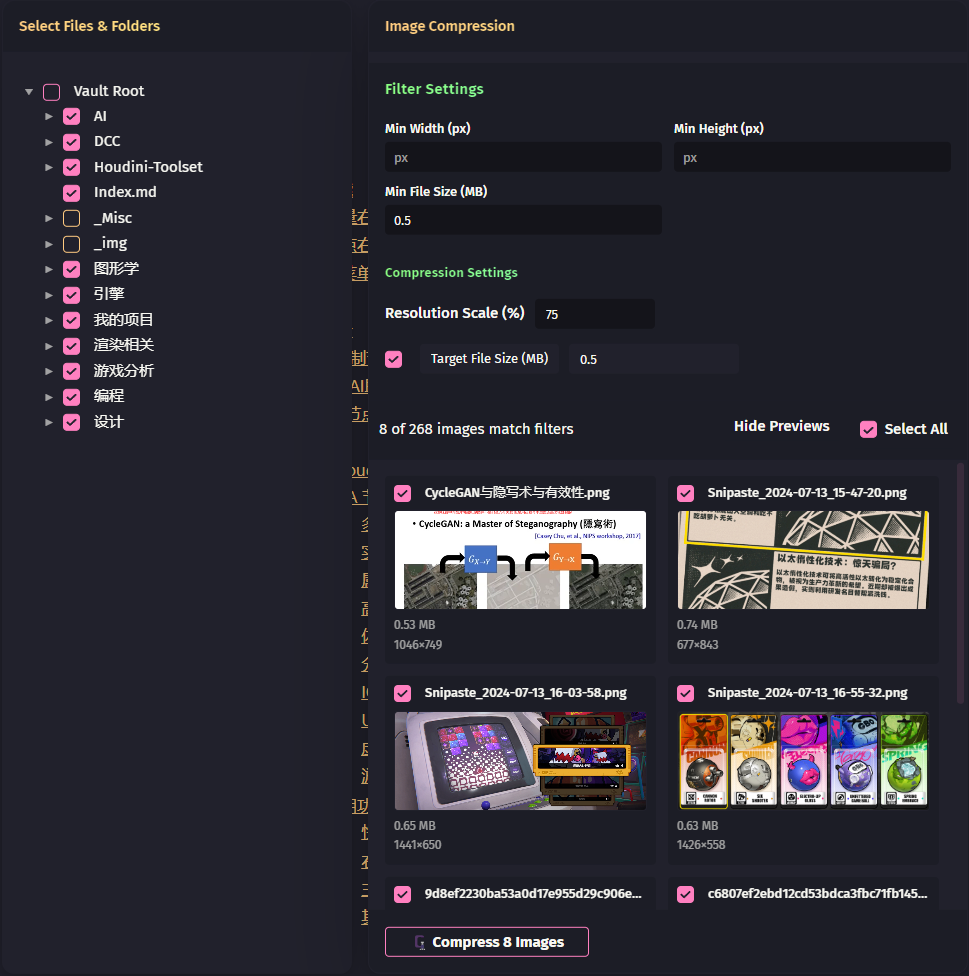

# Image Compressor

[English](#Introduction) | [中文](#简介)

## Introduction

An efficient Obsidian image compression plugin that automatically detects and batch compresses images in your notes to reduce image file sizes.

  

### Features

- **📊 Advanced Filtering**: Filter images by resolution, file size, and compression ratio
- **👀 Real-time Preview**: Real-time filtering with visual preview of image details (size, resolution, compression ratio)
- **🎯 Flexible Compression**: Support quality mode and file size mode with custom resolution compression

### Usage

#### Basic Usage
1. Press `Ctrl/Cmd + P` to open command palette
2. Search and execute "Image Compression: Compress Images"
3. Select folders or files to scan for images
4. Set filtering criteria and compression parameters
5. Select images to compress and click "Compress"

#### Quick Actions
- **Right-click Menu**: Right-click on any folder in file explorer, select "Compress Images"
- **Keyboard Shortcuts**: `ESC` to close interface, `Space` to toggle image selection

### Configuration

#### Filter Settings
- **Min Width/Height**: Only process images exceeding specified pixels
- **Min File Size**: Only process images exceeding specified MB

#### Compression Settings
- **Quality Mode**: Set target quality percentage (default 70%)
- **File Size Mode**: Set target file size (default 0.5 MB)
- **Resolution Scale**: Set compressed image resolution percentage (default 100%)
- **Show Compression Results**: Whether to display results after compression

### Supported Formats

JPEG (.jpg, .jpeg) | PNG (.png) | GIF (.gif) | WebP (.webp)

### Development Info

- **Version**: 1.0.0
- **License**: MIT
- **Dependencies**: browser-image-compression

---

## 简介

一个高效的 Obsidian 图片压缩插件，自动检测并批量压缩笔记中的图片，减少图像大小。

  

### 功能特性

- **📊 高级筛选**：按分辨率、文件大小、压缩比筛选图片
- **👀 实时预览**：实时过滤，可视化预览图片详细信息（大小、分辨率、压缩比）
- **🎯 灵活压缩**：支持质量模式和文件大小模式），并支持自定义压缩分辨率

### 使用方法

#### 基本使用
1. 按 `Ctrl/Cmd + P` 打开命令面板
2. 搜索并执行 "Image Compression: Compress Images"
3. 选择要扫描的文件夹或文件
4. 设置筛选条件和压缩参数
5. 选择需要压缩的图片，点击"压缩"

#### 快捷操作
- **右键菜单**：在文件资源管理器中右键点击文件夹，选择"压缩图像"
- **键盘快捷键**：`ESC` 关闭界面，`Space` 切换图片选择

### 配置选项

#### 筛选设置
- **最小宽度/高度**：仅处理超过指定像素的图片
- **最小文件大小**：仅处理超过指定 MB 的图片  

#### 压缩设置
- **质量模式**：设置目标质量百分比（默认 70%）
- **文件大小模式**：设置目标文件大小（默认 0.5 MB）
- **分辨率大小**: 设置压缩后图像的分辨率百分比 (默认100%)
- **显示压缩结果**: 是否在压缩完成后显示结果

### 支持格式

JPEG (.jpg, .jpeg) | PNG (.png) | GIF (.gif) | WebP (.webp)

### 开发信息

- **版本**：1.0.0
- **许可证**：MIT
- **依赖**：browser-image-compression